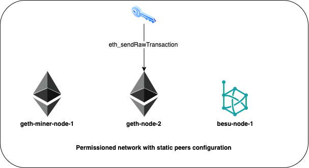

## EIP-1559

https://eips.ethereum.org/EIPS/eip-1559

### Requirements

#### Install Geth with EIP-1559 enabled
```sh
git clone https://github.com/ethereum/go-ethereum.git
cd go-ethereum
gh pr checkout 20618
make geth
```

### Network topology

| Node        |  RPC port | P2P port |
| ----------- |  -------- | -------- |
| geth-node-1 |  8545     | 30303    |
| geth-node-2 |  8546     | 30304    |
| besu-node   |  8547     | 30305    |



### Setup

```sh
sh eip1559/setup.sh
```

### Deploy network

```sh
sh eip1559/deploy-network.sh
```

### Setup and deploy network

```sh
sh eip1559/bootstrap.sh
```

### Send transactions
#### Legacy transactions

```sh
sh eip1559/tx-legacy.sh 0 true http://127.0.0.1:8545
```
#### EIP-1559 transactions

```sh
sh eip1559/tx-eip1559.sh 1 true http://127.0.0.1:8545
```
